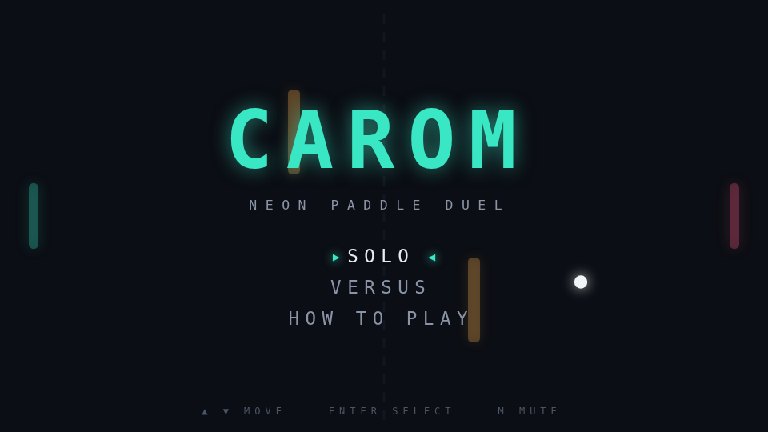

# Carom

Carom is a paddle duel played across a single screen. Two paddles face each other
down a long field, a ball runs between them, and two obstacles stand in the middle
of it all, waiting to send a clean shot somewhere its striker did not intend.

The paddles do more than block. A paddle that is moving when the ball arrives puts
spin on it, and a spinning ball curves as it travels, so where you meet the ball
matters as much as whether you reach it. A late scramble upward and a settled
block send the same shot to very different places.

Those two obstacles turn the field into a bank-shot puzzle. A ball driven straight
down the middle comes back at an angle; a ball threaded past them arrives fast and
flat. Play a few rallies and you stop aiming at the far paddle and start aiming at
the gaps.

Play Solo against the computer or Versus a friend on the same keyboard. First to
eleven, win by two.

