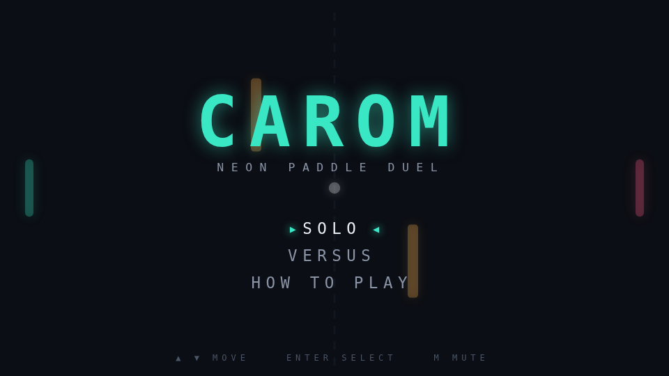

# Carom

Carom is a paddle duel played across a single screen. Two paddles face each other
down a long field, a ball runs between them, and two obstacles drift through the
middle of it, swaying and turning as the rally goes on.

The paddles do more than block. A paddle that is moving when the ball arrives puts
spin on it, and a spinning ball curves as it travels, so where you meet the ball
matters as much as whether you reach it.

The obstacles are what make this version its own game. They never sit still: each
sways up and down and rotates in place, so the same shot played twice hits a
different face and leaves at a different angle. A bank you lined up a second ago
may not be there when the ball arrives, and reading where the faces will be is
most of the skill.

Play Solo against the computer or Versus a friend on the same keyboard. First to
eleven, win by two.

