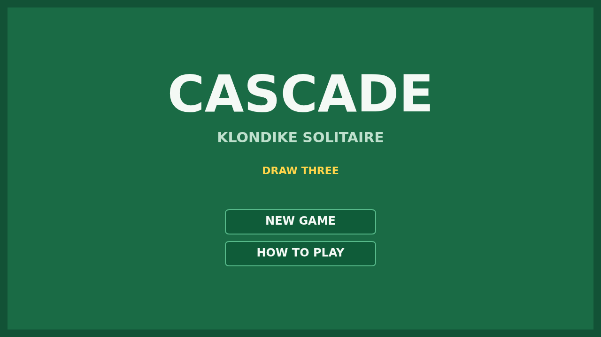

# Cascade

Cascade is Klondike solitaire on a green felt table — the patience most people
just call Solitaire. Twenty-eight cards are dealt into seven columns, most of
them face-down, and the whole game is to get all fifty-two of them home: four
foundations, each built up from Ace to King in a single suit.

The table is played with the pointer. Press a card and it comes up in your hand
along with whatever ordered run is sitting on it; carry it across and let it go
on a column that will take it — a card one rank lower and the opposite color.
Strip a column down to its face-down card and the card turns over. An empty
column takes a King and nothing else. Double-click a card that has a foundation
waiting for it and it goes home on its own.

The rest of the deck waits in the stock. This is the harder deal: a turn lays
three cards on the waste at once, fanned so you can see all three, and only the
front one is yours to play. The two behind it come back only after the stock has
run out and been turned over again, so the order you take cards in is most of the
game.

And then there is the finish the game is named for. The moment the last card goes
home the table gives it all back: the foundations throw their cards into the air
one after another, and they arc across the felt, bounce off the bottom of the
screen and paint the table over as they go.

