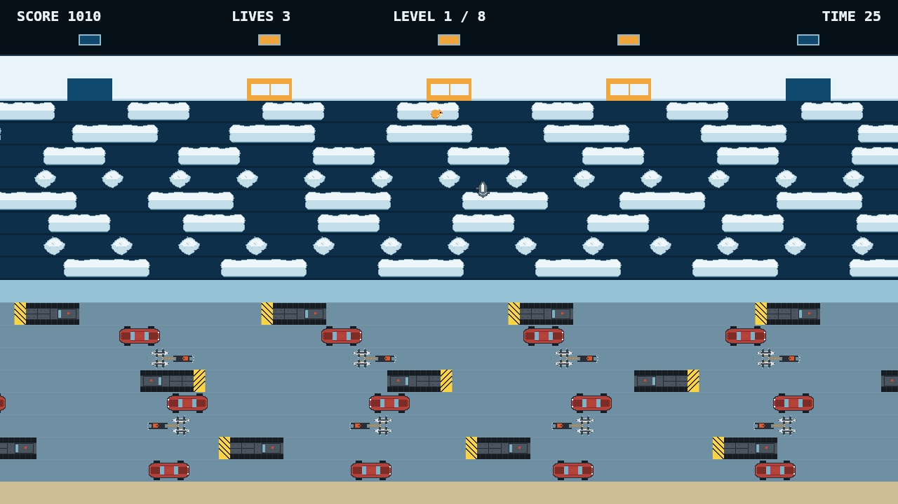

# Floe

Floe is a crossing game on a frozen strait. You are a small tundra critter on the
near shore, and everything you want is at the top of the screen: five bays cut
into the far ice, and a level that is done when all five are filled. You move one
tile at a time, and there is nothing else you can do.

The lower half of the strait is ice, and eight lanes of plows, dogsleds and cars
slide across it in alternating directions. A lane is crossed by reading its gaps
and going when one arrives, and a vehicle that reaches the tile you are standing
on is the end of that crossing. Past a solid median shelf the upper half is open
water, where there is nothing to stand on but the floes drifting along it. Land
on one and it carries you. Miss, and you are in the water.

Then there is the bear. Three rows off the near shore one comes out behind you
and hunts you the rest of the way, gliding the same grid you hop, routing around
the same traffic you are dodging, and swimming out over the water after you. It
is a shade slower than a clean crossing, so hopping forward decisively keeps you
ahead of it. Hesitating does not.

Eight levels, each faster and tighter than the last, three lives, and a clock on
every crossing.

