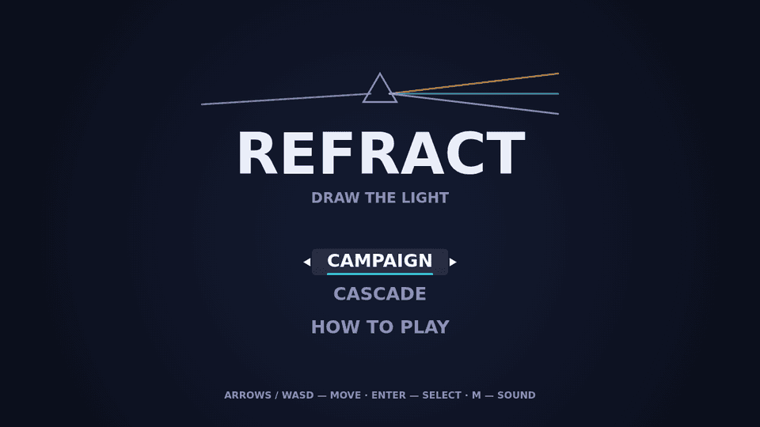

# Refract

Refract is a puzzle of light played on a dark optical bench. A board is a
lattice of optical nodes: emitters that anchor a beam, lenses it has to thread,
and crystals holding charges any beam may spend. Up to three channels of light
cross the same board, told apart by hue and again by silhouette.

You solve a board by drawing it. Press on an emitter and trace, and the beam
follows the pointer from node to node. A move that would break the light simply
does not happen — the beam will not reuse a segment it has already run, will not
cross its own diagonal, will not touch a node another channel has claimed, and
will not enter a crystal with nothing left to give. Nothing scolds you and
nothing resets; the trace stays live and you take the other way round.

Grab a beam anywhere along its length and it shortens to that node, ready to
resume from there, so a wrong turn costs a moment rather than a board. When
every channel runs between its two emitters, through every lens it owes, and
every crystal is exactly spent, the board falls.

Two ways to play. Campaign is a course of twenty-four hand-built boards in four
sets, each opening as the one before it is solved. Cascade is endless: boards
are dealt on demand and the difficulty climbs as they fall, so it runs for as
long as you can keep up.

