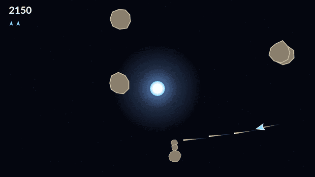

# Shatter

Shatter is an arcade shooter played on one wrapping field of deep space, with a
star burning at the centre of it. You fly a single small ship under pure momentum:
turning and thrusting are all you have, there is no brake, and whatever speed you
build stays with you until you turn around and burn it off. Fly off any edge and
you come straight back in at the opposite one.

The star is what makes the game. It pulls on every rock and every shot but never
on your ship, so your bullets bend as they cross the middle of the field and a
little practice lets you curve one right around the star onto a rock sitting on its
far side. Its core is solid: a shot that reaches it is swallowed, a rock that falls
in is thrown back out from the edge of the field, and your ship grazes around it
and slides free.

Rocks come apart rather than vanish. A Large splits into two Mediums, each Medium
into two Smalls, and only a Small leaves the field for good, so clearing a wave
means the board gets busier before it gets emptier and the fragments come at you
faster than the rock they came from. Break the last one and a denser, quicker wave
arrives behind it.

Eighteen seconds in, a saucer turns up. It weaves across the field, steers around
the star, and takes an aimed shot at you every second and a half. It pays the rocks
no attention at all, so it is simply one more thing in the air while you are
already busy, and two hundred points if you can put a round through it.

