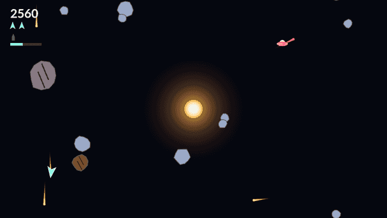

# Shatter

Shatter is an arcade shooter played on one wrapping field of deep space, with a
star burning at the centre of it. You fly a single small ship under pure momentum:
turning and thrusting are all you have, there is no brake, and whatever speed you
build stays with you until you turn around and burn it off. Fly off any edge and
you come straight back in at the opposite one.

The star is what makes the game. It pulls on every rock and every shot but never
on your ship, so your bullets bend as they cross the middle of the field and a
little practice lets you curve one right around the star onto a rock sitting on its
far side. Its core is solid: a shot that reaches it is swallowed, a rock that falls
in is thrown back out from the edge of the field, and your ship grazes around it
and slides free.

The rocks out here wear armor. A Large takes three hits, a Medium two, and every
hit that leaves a rock standing flashes it and leaves it visibly more broken, so
you can read how much is left in one before you commit to it. That makes a wave a
long fight, and it is why the ship carries a torpedo: one guided munition that
locks onto whatever sits in a narrow cone ahead of it, flies dead straight through
the well, and destroys any rock outright however much armor it had left. Spend it
and you spend ten seconds watching the bar under the readouts fill before you have
another.

Eighteen seconds in, a saucer turns up. It weaves across the field, steers around
the star, and takes an aimed shot at you every second and a half while you are
already busy chewing through the wave.

