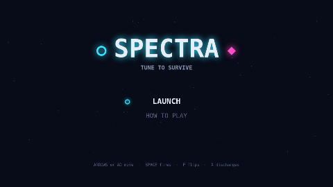

# Spectra

Spectra is a formation shooter played on one band at a time. You fly a lone
resonator-fighter along a lane at the bottom of a starfield while crystalline
drones sweep in from above, assemble into a swaying block, and peel off one by
one to dive at you.

Your cannon is tuned to cyan or magenta, and a shot only destroys a drone of the
band you are holding. That same band is your shield: fire coming down in your
own band is absorbed and charges a resonance meter, and fire in the other band
kills you. The formation always carries both bands at once, so the drone you
want dead and the bullet you have to survive want you tuned opposite ways, and
the flip that saves you locks your cannon for a beat.

Three drones press that one idea three different ways. A Shard holds a single
band. A Flux oscillates between the two, and while it shimmers nothing can touch
it. A Prism wears both at once, a shell over a core of the opposite band, and if
you let it dive all the way to the floor it inverts what the whole field reads
as.

Fill the meter and you can spend it. A discharge blooms out from the ship and
wipes every diver and every bullet in the air without caring what band it is.
Clear the wave and the next stage comes in faster, and every third stage breaks
the pattern with a forty-drone flyover that fires nothing and pays a bonus for a
clean sweep.

