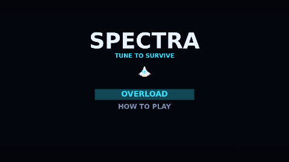

# Spectra

Spectra is a formation shooter played on one band at a time. You fly a lone
resonator-fighter along a lane at the bottom of a starfield while crystalline
drones sweep in from above, assemble into a swaying block, and peel off one by
one to dive at you. Your cannon is tuned to cyan or magenta, only a matching
shot destroys, and that same band is your shield: fire in your own band is
absorbed and charges a resonance meter, fire in the other band kills you.

Here a shot of the wrong band is not wasted. It puts a charge on the drone it
hit, the telegraph on that drone fills, and the third charge overloads it. The
shot you would otherwise have held is now a decision: take it, and something
happens.

What happens depends on what you hit. An overloaded Shard drops out of the block
and plunges at you far faster than it would ever dive. An overloaded Flux flips
to its opposite band and sprays a fan of fire. An overloaded Prism bursts in
both bands at once, and one broken before its shell is gone calls in an escort
to stand beside it. A Flux caught mid-shimmer takes nothing at all.

Fill the meter and you can spend it on a discharge that wipes every diver and
every bullet in the air. Three lives, waves that come in faster every stage, and
a forty-drone flyover every third stage that fires nothing and pays a bonus for
a clean sweep.

