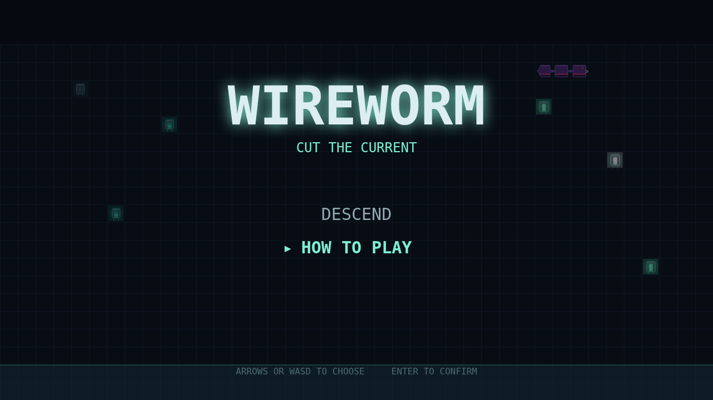

# Wireworm

Wireworm is a fixed shooter played on a circuit board. A segmented data-worm
enters along the top and winds its way down through a field of capacitor nodes.
You are the defrag cursor, pinned to a shallow band along the floor, firing
straight up to cut the worm apart before it winds all the way down to you.

The board fights on your behalf, if you let it. Every node the worm is turned by
takes on charge, so the collisions that steer it also arm the terrain it is
steering through. Drive a node all the way to critical, shoot it, and it
detonates — the arc floods the whole charged cluster around it, clearing those
nodes and frying every worm segment caught in the blast.

Nothing you do is free. Every segment a bolt cuts leaves a fresh node behind, so
the field thickens as the fight goes on and the lanes you were shooting up close
one by one. Cut a worm through the middle and you have two worms, each winding on
its own clock. Leave a node at critical in front of the head and the worm stops
winding and dives straight down that column at you.

Twelve levels deep, three lives, one board, and the field you are standing in is
the field you made.

