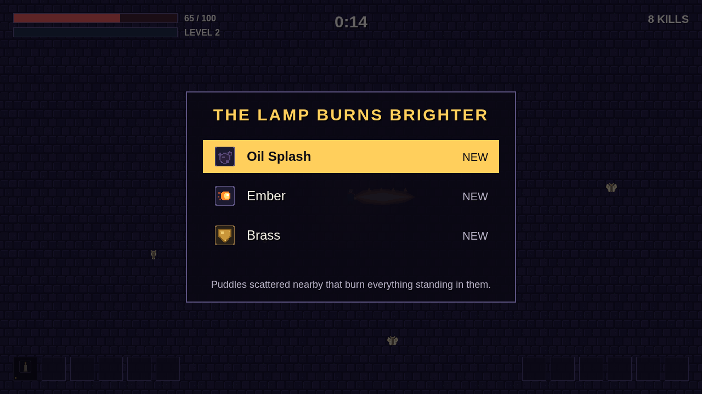

# Wick

Wick is a night spent keeping one lamp alight. You play a lamplighter walking a
dark city while moths, rats and worse close in from every side, and the only
thing you steer is where you stand. Your tools fire themselves.

That is the whole of the bargain. A slash sweeps the ground in front of you on
its own beat, a bolt leaves for the nearest moth without being aimed, a lantern
rides a circle around you whether you asked it to or not. What you decide is the
shape of the crowd: where to lead it, when to cut back through it, and which gap
to open before it closes.

Every kill leaves a gem, and every gem fills the bar. When it fills, the lamp
burns brighter and three offers arrive: a new tool, a level on one you already
carry, or a trinket that quietly changes all of them at once. Carry a tool to
its limit beside the right trinket and the next chest you open turns it into
something else entirely.

The night runs ten minutes and the schedule never eases. Bats arrive, then
beetles, then things that split and things that keep coming back, and at nine
minutes the Dark itself walks in. Survive to dawn and the lamp is still lit.

