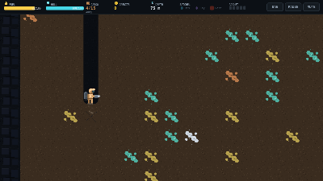

# Deepcore

You are the last prospector on a dead mining world, and the only way off it is a
rocket you have to build yourself. The dropship is scrap. The launch pad is
derelict. Everything the rocket needs is under your feet, and the only tools you
have for getting at it are a handheld drill and a jetpack with a tank you pay for
by the unit.

A dig starts at the camp. You walk east past the Ore Market and the Save Pad,
find a patch of ground you like, hold down, and sink. The drill bites through
topsoil in a couple of seconds a tile, and the shaft closes into a narrow bore
behind you as the depth meter climbs. Veins come past in the wall — dull
rust-brown flecks near the surface, silver seams further down, and now and then a
cut jewel that pays for a whole trip. You take what fits and keep going, because
the money is always one band deeper.

Then you have to get home. Falling is free; climbing is not. Every unit of ore in
the bay is weight the jetpack has to lift, and a rich haul climbs slower, burns
more fuel, and past a limit will not leave the ground at all. So the real
decision of every dig is when to stop, and the worst place to make it is four
hundred meters down with a quarter tank left and a seam of Pyronium in front of
you.

The deep does not just make you poor, it kills you. Gas pockets look exactly like
ordinary rock and give themselves away only with a faint wisp, and drilling into
one is a hull hit that gets worse the deeper you are. Lava pools sear on contact
and burn a lump out of you to bore through. And when you finally reach the Core
and chip a sample off it, a ninety-second timer starts that does not stop for the
surface, for a shop, or for anything but the Ignition Core going onto the rocket.

Sell, refuel, repair, buy a bigger tank or a harder drill, and go again. Five
components, twenty-five thousand Credits, two buried materials and one unstable
sample. Then you launch, and the rock is somebody else's problem.
