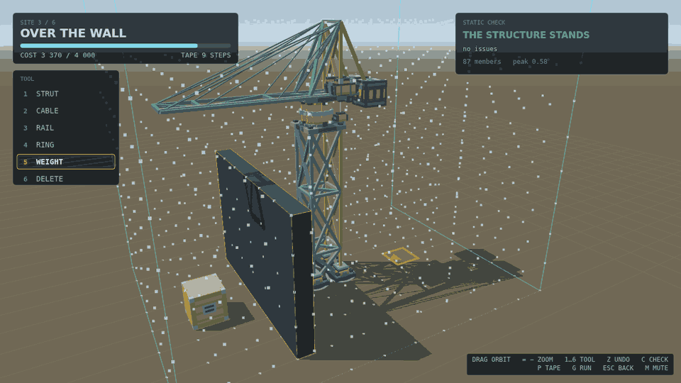

# Gantry

Gantry is a crane-building puzzle set in a 3D construction yard. A site hands
you anchor points on the ground, a build envelope, a budget, and one or two
loads that have to end up on their pads. Everything between those is yours to
rig: struts, cables and rails placed node by node on a two-unit lattice, the
ring the arm slews on, a run of rail for the trolley to drive out along, and
counterweights hung off the back until the whole thing balances.

Nothing is steered by hand. You write a tape — an ordered program for the four
axes, slew, trolley, hoist and grip, with attach and release to take a load onto
the hook and set it down — then press run, turn the camera, and watch what you
wrote play out. The truss is solved as it moves, so every member colors by how
hard it is working and one driven past its limit is gone for the rest of the
run. The load hangs on a real cable, so a lift slewed briskly arrives swinging,
and a swinging crate can miss its pad or find a wall.

Cost and time are the score, and that is the tension of the whole thing: a
light crane run fast beats a heavy one run cautiously, right up until the speed
you bought buckles a strut or carries the crate past the pad. Six sites, each a
fresh argument with the same four axes.

