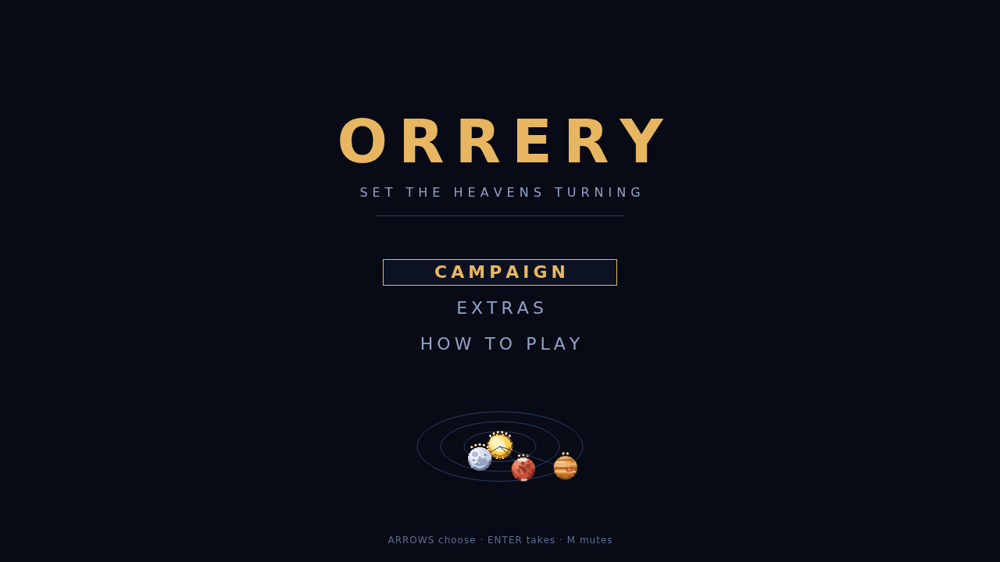

# Orrery

Ninety-one hexes lie under a dark sky, and every challenge is a commission: it
names the constellations it wants and the reagents it will hand you, and
everything between the two is a machine you build yourself. Rises push the
reagents up out of the field and sets swallow the finished constellations;
between them stand brass arms, engraved sigils, and whatever route you can
find.

You start on an empty field. Parts come out of the tray on the left and are
dragged onto a hex — arms one to three hexes long, some with two, three or six
grippers, a piston, the zodiac wheel, track laid a hex at a time — and each is
turned into place while the ghost is still under your hand. Then every arm gets
a tape: a looping row of instructions typed in below, one key per cell. Rotate
and pivot, extend and retract, grab and drop, advance and recede. Ten
instructions, no conditions and no branches, and every arm runs its own tape on
the one period the whole machine shares, forever.

Sigils are the other half of the answer. Engrave one on a hex and it acts on
whatever is standing there when the cycle turns: a `wane` cools an essence back
down to dust, a `bind` writes a filament between two motes and makes them one
rigid constellation, a `sunder` cuts one apart again, a `confluence` folds four
essences into a single aether. A machine is a route as much as a mechanism — the
arm carries the mote across the engraving, and the engraving does the rest.

Then you press play and stand back. The machine has to deliver six times over
without faulting, and the usual fault is two motes swinging through the same
place at the same instant: the run freezes on the moment it happened and marks
the parts that caused it. Finish, and the machine is scored three ways — what it
cost, how many cycles it took, how much of the field it used, every one of them
better lower. Each challenge keeps your bests.

There are two ways to play. Campaign is a course of thirteen challenges worked
in order, opening on one arm carrying one mote and closing on machines of eight
parts and more, each unlocked by the one before it. Extras is a shelf of ten
standalone puzzles, open from the start and taken in any order, from a first
delivery to a bonded procession of moons a set will only accept by the chain.
Neither is finished the first time you solve it.
