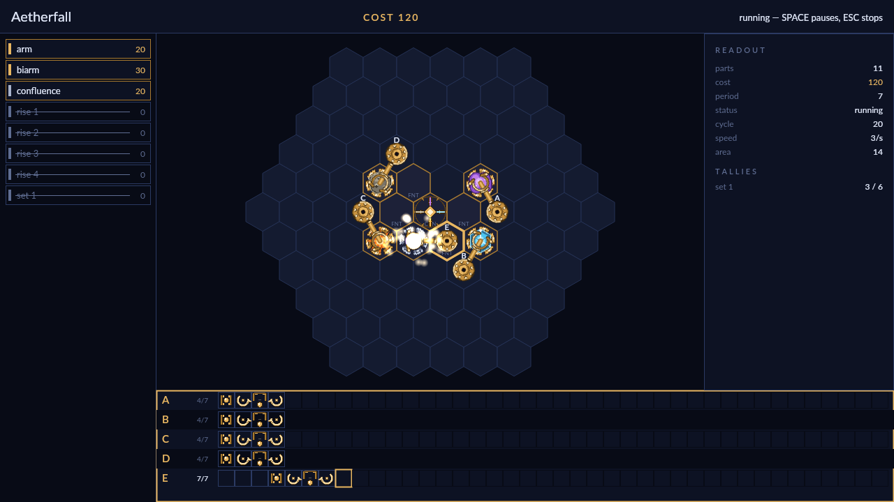

# Orrery

Ninety-one hexes of dark brass, and a challenge that names what has to come
off them: constellations of celestial motes, six of each, delivered. Reagents
arrive at the rises you place, and nothing moves them but the machine you
build. You engrave sigils on the field, stand arms over them, write each arm a
short loop of instructions, and set the whole thing turning.

A challenge opens on an empty field with a tray down its left side: the arms
and wheels, the sigils this challenge allows, and its rise and set. Drag one
out onto a hex and it follows the pointer as a ghost — turn it, lengthen it,
and let go where it belongs. Then the tape panel along the bottom, one row per
arm: press keys to write `grab`, `rotate`, `pivot`, `drop`, a blank cell to
rest. Every tape loops together on one shared period, so the machine is as
much a matter of timing as of reach.

Run it and the arms swing in step. Grippers close on motes and carry whole
constellations across the field; sigils bind two motes with a filament,
transmute what rests on them, or shatter an aether back into its four
essences; a set takes each finished constellation and counts it. Two motes
that touch stop the run cold, so a machine is usually watched, paused, stepped
a cycle at a time, and corrected a cell at a time. Finish, and the run is
judged three ways at once — what it cost, how many cycles it took, and how
much of the field it swept — and each best is kept.

There are two ways to play. Campaign is a course worked in order, opening on a
single arm and a single sigil and adding one idea at a time, each challenge
unlocked by the one before it. Extras is a shelf of ten standalone challenges,
open from the start and playable in any order, from a two-part warm-up to
machines that fill half the field. Both are the same game underneath: an empty
field, a tray, and whatever you can make turn.
