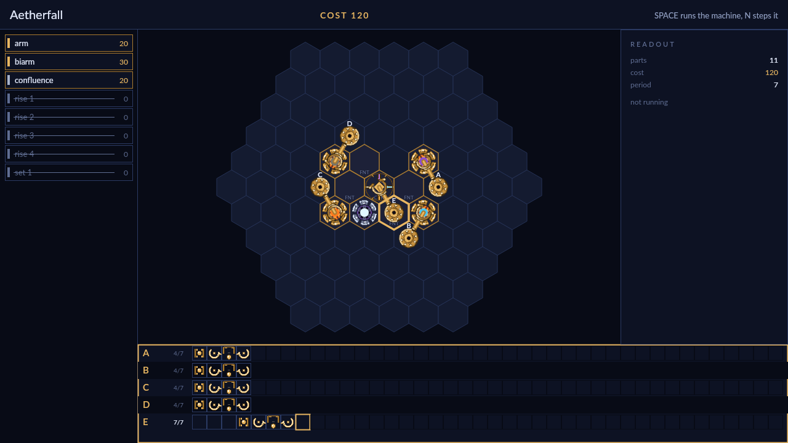

# Orrery

Ninety-one hexes of dark sky, and a challenge that wants something made in it.
Each one names the constellations it is asking for — motes of nebula, comet,
nova and meteor, bound together into a shape — and names the reagents it will
push up onto the field for you. Everything between the two is yours: a machine
of brass arms and engraved sigils that runs on its own, forever, until the
order is filled.

You build it in the editor. Parts come out of a tray at the left and go down
with the pointer — drag an arm onto a hex, turn it and lengthen it while the
ghost is still under your hand, let go. Sigils are engraved the same way: a
`wane` that cools an essence to dust, a `bind` that writes a filament between
two motes and makes them one rigid constellation, a `confluence` that folds all
four essences into a single aether the moment its founts are full. Sigils act
on whatever happens to be resting on them at the turn of a cycle, so a machine
is a route as much as a mechanism — the arm only has to carry the mote across
the engraving.

Then you write the tapes. Ten instructions, no branches and no conditions:
grab and drop, rotate and pivot, extend and retract, advance and recede. Every
arm loops its own tape on one period shared by the whole machine, so an arm
that grabs on cycle three and lets go on cycle five will do it again on ten and
twelve, and forever after. One arm is easy. Getting five of them to hand motes
to each other on the same beat, and never to swing two motes into the same hex
at the same moment, is the game — a fault freezes the run on the instant it
happened and lights up the parts that caused it. Finish instead and the machine
is scored three ways at once: cost, cycles, and how much of the field it used,
all of them better lower. There is always a smaller machine.

There are two ways to play. Campaign is a course of thirteen challenges taken
in order, each unlocking the next, introducing a sigil or a kind of pressure
and then asking you to use it beside everything before it — from a three-part
opener to a finale that needs the whole workshop. Extras is a shelf of ten
standalone puzzles, all open from the start, to pick off in any order and go
back to when you think you see a leaner answer. Both keep your best cost,
cycles and area for every challenge, so neither is ever really finished.
